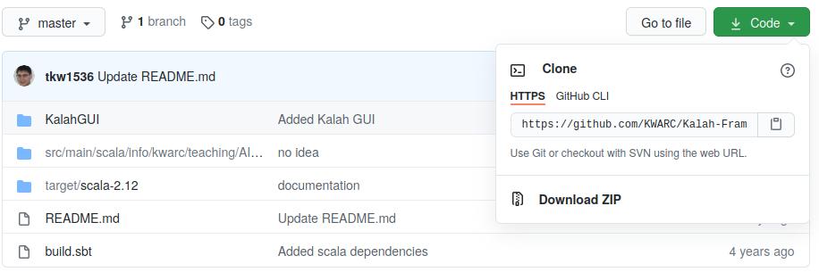
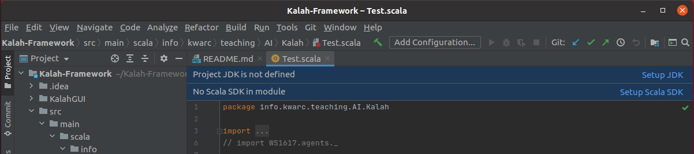
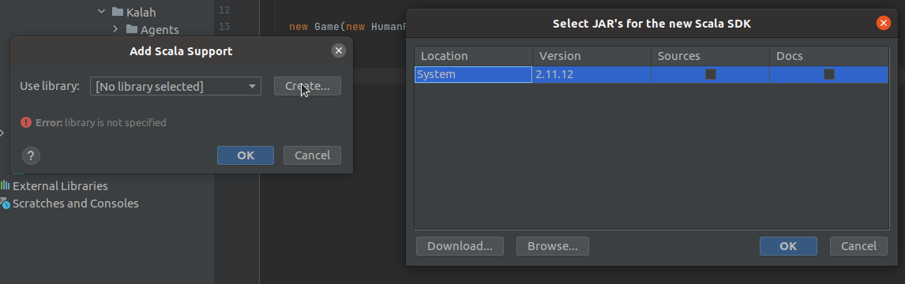
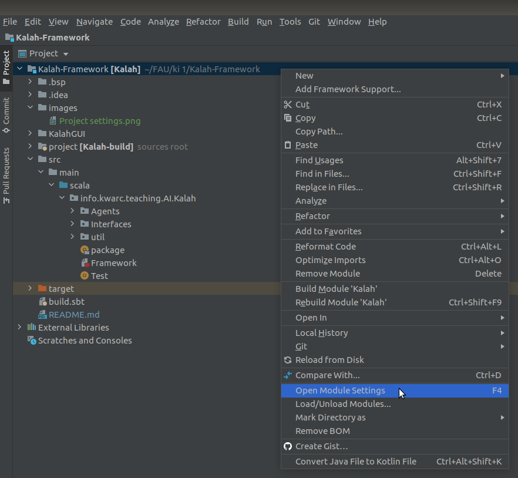
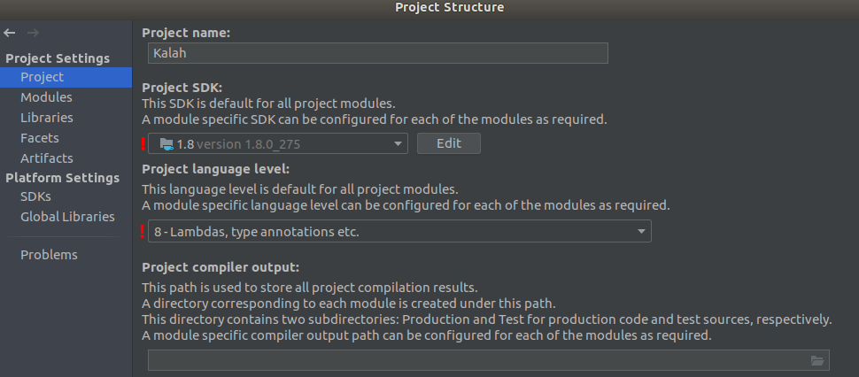
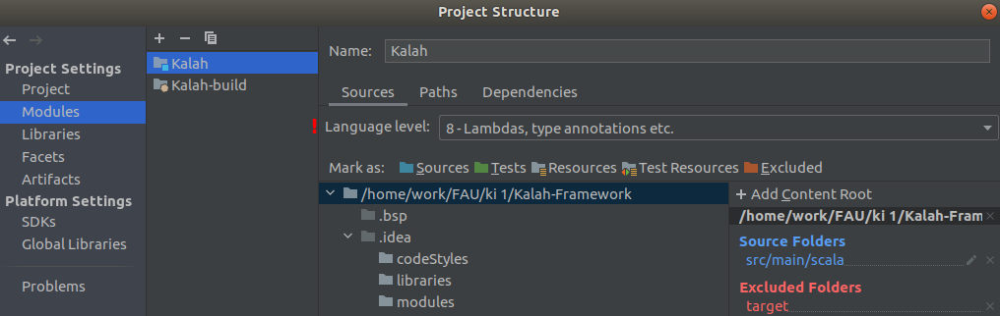
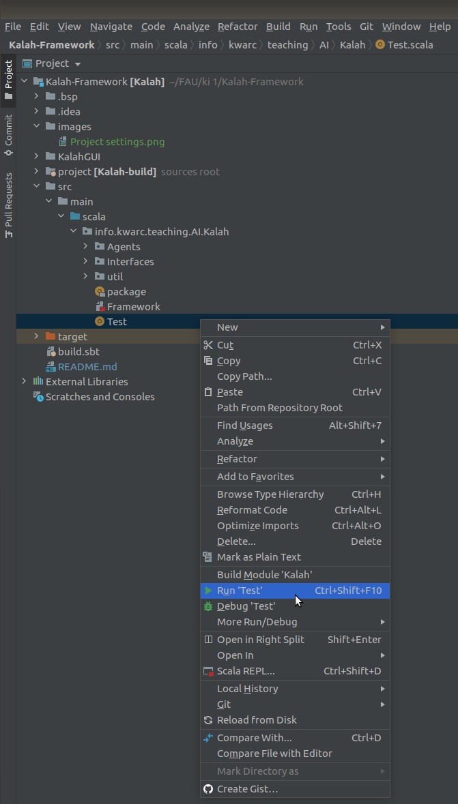
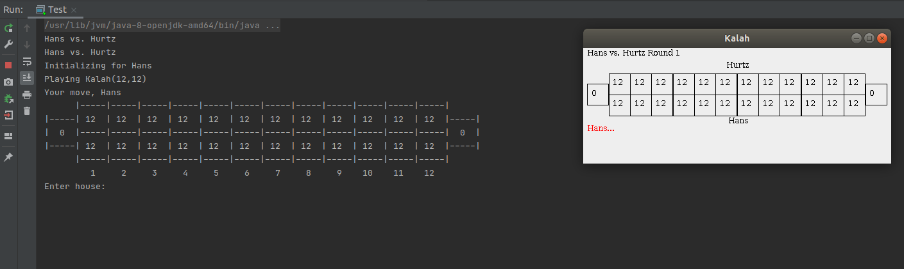

# Kalah-Framework
Kalah framework for the AI course at FAU.

Discussion Forum: https://fsi.cs.fau.de/forum/144-Kuenstliche-Intelligenz

This contains:
- `target/scala-2.12/kalah_2.12-1.0.jar` contains the compiled framework in total
- `target/scala-2.12/kalah_2.12-1.0-javadoc.jar` contains the packaged (javadoc) documentation
- `target/scala-2.12/api` contains the javadoc documentation and
- `src` contains source files in scala and (thanks to Marcel Rupprecht for doing all the work!) java interfaces so you don't have to take care of converting scala data structures.

You are free to use scala or java; even though the framework is written in scala, all the interfaces you'll need to use standard java data types only.

To implement your own agent, create a new class/object extending [[info.kwarc.teaching.AI.Kalah.Agents.Agent]]
and implement the required methods (init and move). For details see the documentation.

**Rules:**
- You can submit a *class*  or (in the case of scala) an *object* for your agents. If you submit a class, for each game we will create a new instance of this class. If it's an object, make sure that it works with consecutive games (i.e. be careful with states).
- Please give your class/object a *unique name* (i.e. not something like `MyAgent`) and make sure that the *name* string value of your class/object is identical.
- You can submit `.class`, `.java`, `.scala` or `.jar`-files; please put your agent in the classpath `info.kwarc.teaching.AI.Kalah.WS2021.agents`
- Your submission may not exceed 200 MB.
- Your implementation must not interact with external resources, such as the network or other programs.
- If you use additional objects/classes, please put them in a unique namespace *extending* `info.kwarc.teaching.AI.Kalah.WS2021.agents`
- Agents need to implement two methods: *init* and *move*. The first one will be called when the game starts. Your agent will be handed an instance of the `Board`-class, which contains e.g. the number of houses and starting seeds per house.
- Your *init* method has about 10 seconds to terminate. If it doesn't terminate in 10 seconds, that agent will lose the current game.
- Your *move* method has about 5 seconds to return a valid move. If it doesn't return a valid move in the time limit, its [[info.kwarc.teaching.AI.Kalah.Agents.Agent.timeoutMove]] variable will be taken instead.
- The exact time limits may change, make sure your implementations can deal with any provided limit.
- Given the time restrictions, *please make sure your agents are thread-safe and can be forcefully killed in a reasonable time frame*.

## Agent GUI
Luca Reeb has kindly provided a GUI for debugging purposes in the subfolder `KalahGUI`. For a description, see `KalahGUI/README.md`.


## Getting started

Tested for Ubuntu (18.04 LTS, 20.04 LTS)

### Requirements:
- Java 8
- Scala
- Intelli J IDEA (Community and Ultimate should both work)
- Git (optional)

The .scala files should be compatible with scala 2.10. If there are any problems with the scala version, let me know as soon as possible via the forum.
If there are any other problems with using my framework (like java interfacing) please let me/us know via the forum as soon as possible.

You can install the dependencies and IDE via:
```bash
sudo apt install openjdk-8-jdk scala git
sudo snap install intellij-idea-community --classic --edge
```

### Cloning the Repository:

On the website of this repository, you should find the link for pulling in the top right above the code.
you can also download the repo as a zip file.



Also, you can directly go into the directory you want the repo to be and insert the following command into your terminal.

```bash
git clone https://github.com/KWARC/Kalah-Framework.git
```

### Setup of the Project:

- Open Intelli J and install the Scala Plugin.
- Click on open from Folder and choose the folder you cloned the Repo into.
- Open file *"Kalah-Framework/src/main/scala/info/kwarc/teaching/AI/Kalah/Test"*, you will be ask which scala plugin should be used, choose the installed one.
- Restart Intelli J
- You will be ask to set the environments of Java and Scala.
  

  
- Set Java to *"1.8"* and the scala environment to the system environment you installed.



- Now close Intelli J, delete the cloned repo and clone it fresh again.
- Open Intelli J, click on open from Folder and choose the folder you cloned the Repo into.
- Intelli J should now install the dependencies for the project from the sbt file, which might take some "long" time.
- If this is not the case remove the cloned folder and clone anew and  repeat the steps before.
- Now you right-click on the Top Folder in your Project Browser and on *"open module settings"*.



- In Topic "Project" change the *"SDK version"* in the first drop-down menu to *"1.8"*.
- On the Second drop-down menu change the *"Project language level"* to *"8 - Lambdas, type annotations etc"*.



- In "Modules" you select *"Kalah"* and then *"language level"* to *"8 - Lambdas, type annotations etc"* in the drop-down menu.



### Start the Main Program:

- Build the Project
- Navigate to *"Kalah-Framework/src/main/scala/info/kwarc/teaching/AI/Kalah"*
- There you will find the Test.scala, right-click the file and select *"Run Test"*



- The program should now start and show you the game interface. It is possible to enter the moves in the command line.



